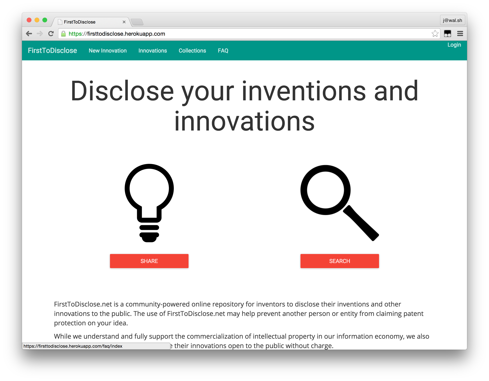
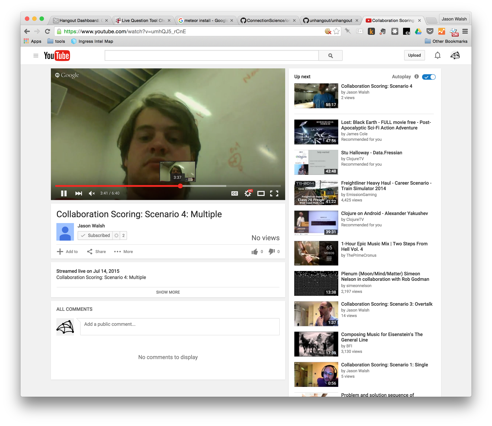
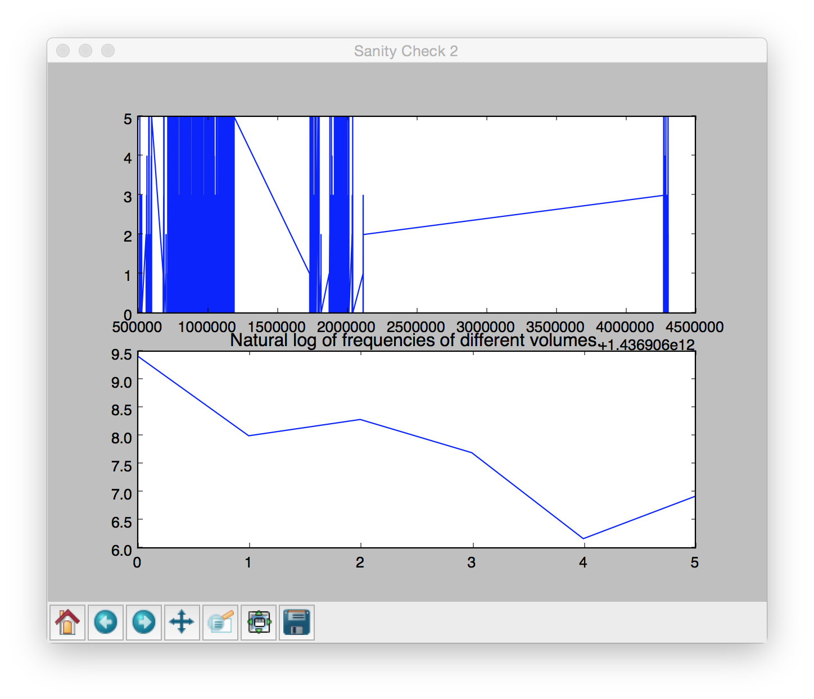
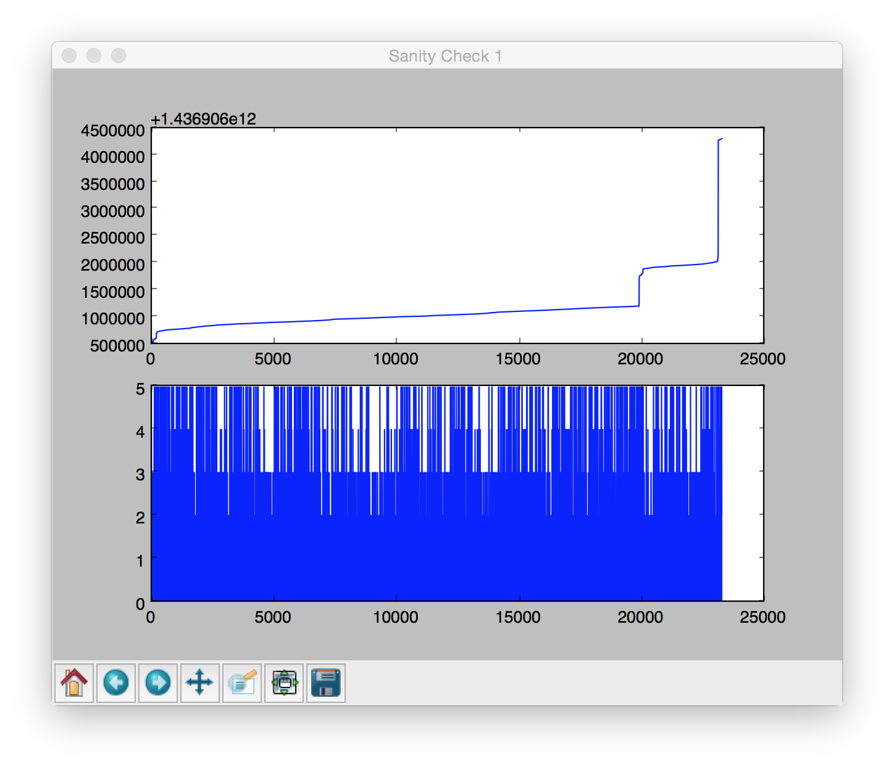
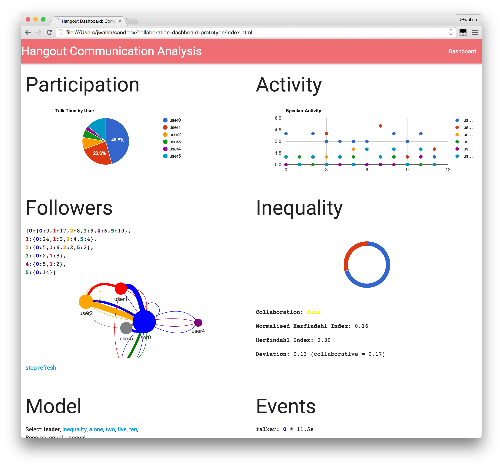

# online-hackathon-review

## Create Projects and Measure Success 

- https://firsttodisclose.herokuapp.com/

## Core Project Construction 

## Project Workspaces 

- Google Hangouts
- GitHub
- IRC
- Mailing Lists
- Slack

## Google Hangouts Collaboration Scoring 

- https://github.com/ConnectionScience/collaboration-dashboard-prototype

## Recording and Saving Team Chats

- https://www.youtube.com/watch?v=oT1RPSLa9l0

## Analyzing Collaboration 

## Synthetic Models of User Talk Behavior 

- http://p.wal.sh/communication-model/

## Extending Existing Collaboration Tools 

Hackathon, Unconference, and Moocs

- https://github.com/unhangout/unhangout

## Open Development 

https://github.com/ConnectionScience/OnlineHackathon
